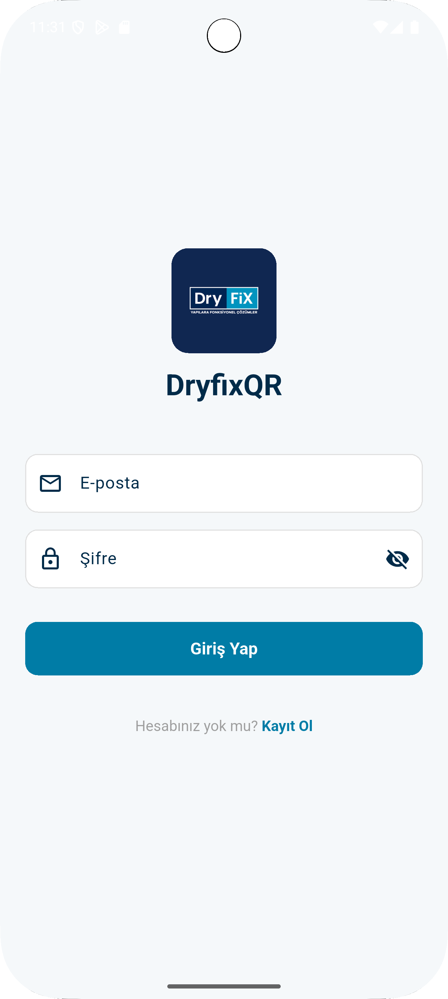
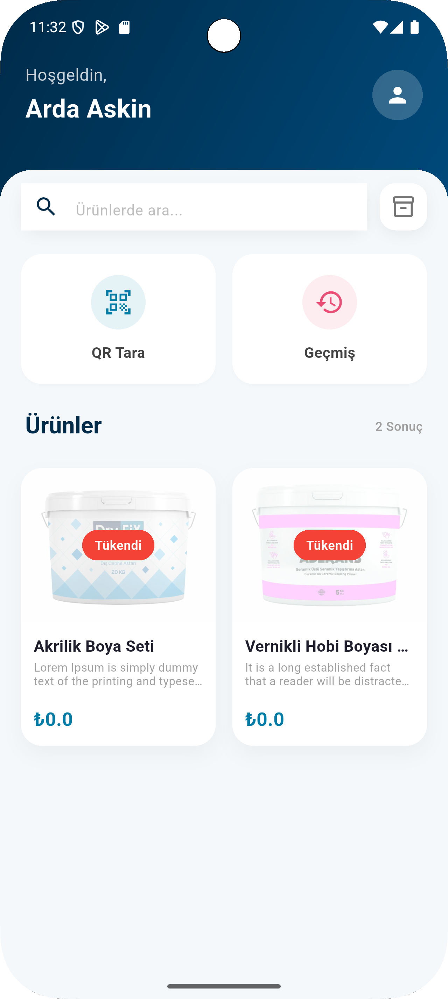
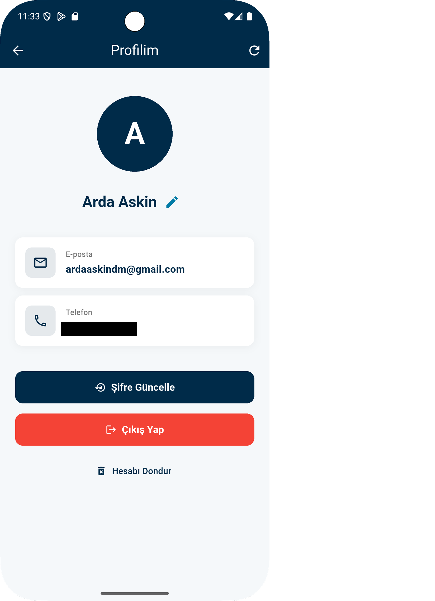

# Dryfix QR App

### Teknik Özellikler ve Mimari

Uygulamayı geliştirirken şu mimari tercihleri önceliklendirdim:

- **Mimari:** Kodun okunabilirliğini ve sorumluluk ayrımını sağlamak için katmanlı mimari tercih ettim. `Screens`, `Services` ve `Models` katmanları tamamen birbirinden bağımsız çalışmaktadır.
- **Bağımlılık Yönetimi:** Servisleri yönetirken Service Locator kullandım. Bu sayede her servisin tek bir örneği üzerinden kaynak yönetimi yapabiliyorum.
- **Global Auth Yönetimi:** Kullanıcının oturum süresi dolduğunda (`401 Unauthorized`) uygulamanın her yerinde bunu algılayan ve giriş ekranına yönlendiren bir Interceptor mekanizması kurdum.
- **Hata Yönetimi:** API'den gelen 404, 409 veya 422 gibi özel durumları yakalayıp kullanıcıya anlamlı SnackBar mesajları olarak döndüren bir yapı oluşturdum.

---

## Kullanılan Teknolojiler

- **Network:** Dio
- **Güvenli Depolama:** Flutter Secure Storage
- **QR Tarama:** Mobile Scanner
- **Tarih İşleme:** Intl

---

## Ekran Görüntüleri

  
  
  

**Not:** Uygulamanın tasarımı Dryfix kurumsal renkleri dikkate alınarak geliştirilmiştir.
